---
## Front matter
title: "Лабораторная работа №3"
subtitle: "Язык разметки Markdown"
author: "Бочаров Андрей"

## Generic otions
lang: ru-RU
toc-title: "Содержание"

## Bibliography
bibliography: bib/cite.bib
csl: pandoc/csl/gost-r-7-0-5-2008-numeric.csl

## Pdf output format
toc: true # Table of contents
toc-depth: 2
fontsize: 12pt
linestretch: 1.5
papersize: a4
documentclass: scrreprt
## I18n polyglossia
polyglossia-lang:
  name: russian
  options:
	- spelling=modern
	- babelshorthands=true
polyglossia-otherlangs:
  name: english
## I18n babel
babel-lang: russian
babel-otherlangs: english
## Fonts
mainfont: IBM Plex Serif
romanfont: IBM Plex Serif
sansfont: IBM Plex Sans
monofont: IBM Plex Mono
mathfont: STIX Two Math
mainfontoptions: Ligatures=Common,Ligatures=TeX,Scale=0.94
romanfontoptions: Ligatures=Common,Ligatures=TeX,Scale=0.94
sansfontoptions: Ligatures=Common,Ligatures=TeX,Scale=MatchLowercase,Scale=0.94
monofontoptions: Scale=MatchLowercase,Scale=0.94,FakeStretch=0.9
mathfontoptions:
## Biblatex
biblatex: true
biblio-style: "gost-numeric"
biblatexoptions:
  - parentracker=true
  - backend=biber
  - hyperref=auto
  - language=auto
  - autolang=other*
  - citestyle=gost-numeric
## Pandoc-crossref LaTeX customization
figureTitle: "Рис."
tableTitle: "Таблица"
listingTitle: "Листинг"
## Misc options
indent: true
header-includes:
  - \usepackage{indentfirst}
  - \usepackage{float} # keep figures where there are in the text
  - \floatplacement{figure}{H} # keep figures where there are in the text
---

# Цель работы

Целью работы является освоение процедуры оформления отчетов с помощью легковесного
языка разметки Markdown.

# Выполнение лабораторной работы
Проведем первоначальную настройку git, установим имя владельца
репозитория, почту, вывод сообщений в кодировке utf-8. Настроим имя ветки по умолчанию, установлены параметры autocrlf и safecrlf.(рис. [-@fig:001]).

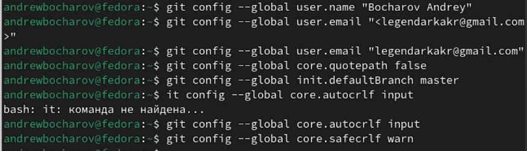{#fig:001 width=70%}

Сгенерируем пару ssh-ключей для безопасного подключения к Github. (рис. [-@fig:002]).

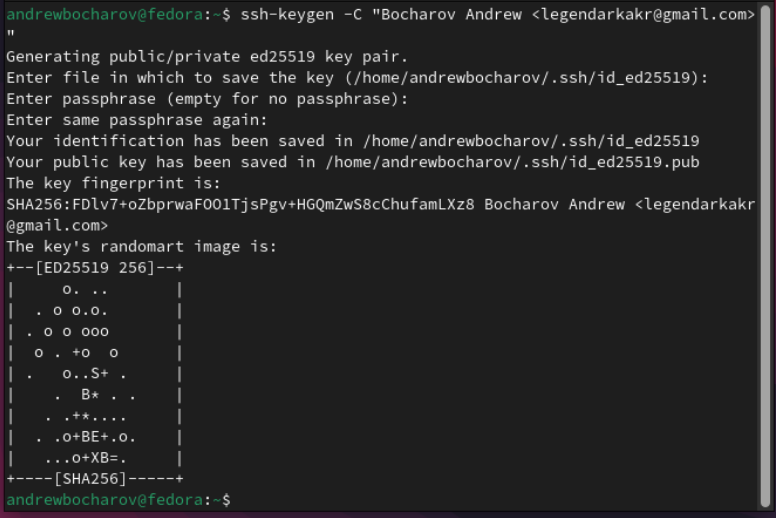{#fig:002 width=70%}

Публичный ключ лежит по адресу /home/andrewbocharov/.ssh/id_ed25519.pub.
Командой cat выведем ключ на экран и скопируем его в буфер обмена (рис. [-@fig:003]).

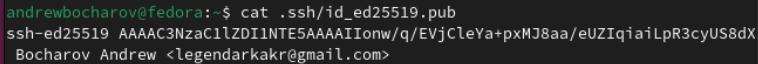{#fig:003 width=70%}

Этот ключ необходимо вставить на Github в настройках, разделе SSH and
GPG keys, после нажатия добавить новый SSH ключ (рис. [-@fig:004]).

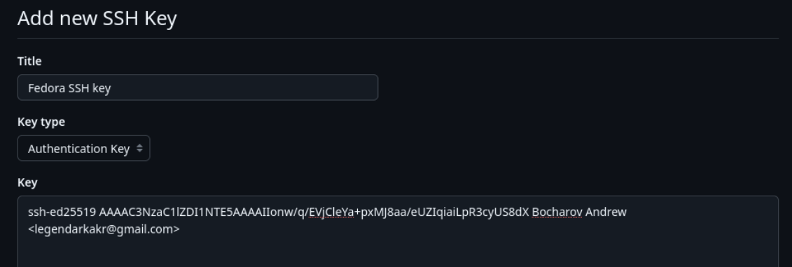{#fig:004 width=70%}

Далее используя шаблон репозитория https://github.com/yamadharma/course-
directory-student-template, создадим свой репозиторий (рис. [-@fig:005]).

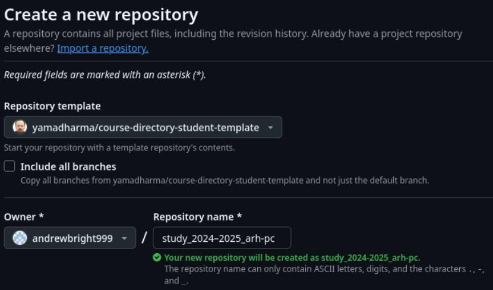{#fig:005 width=70%}

Локально на компьютере создадим директорию /work/study/2023-
2024/"Архитектура компьютера". Перейдем в нее и скопируем содержимое
нового репозитория в эту директорию. (рис. [-@fig:006]).

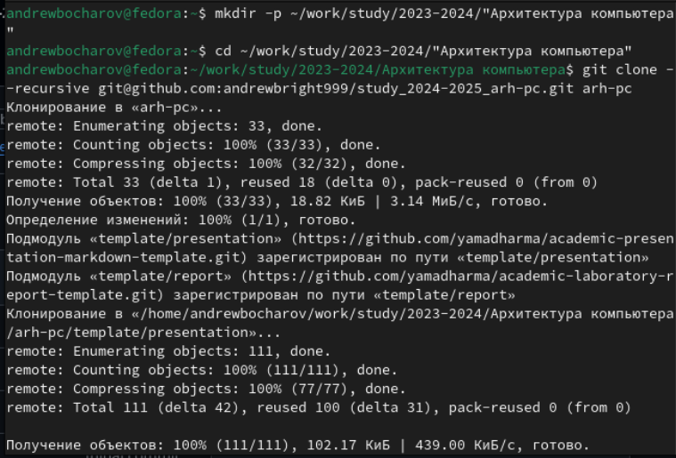{#fig:006 width=70%}

Локально на компьютере создадим директорию /work/study/2023-
2024/"Архитектура компьютера". Перейдем в нее и скопируем содержимое
нового репозитория в эту директорию. (рис. [-@fig:007]).

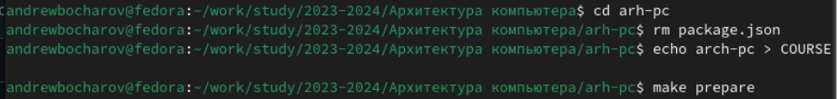{#fig:007 width=70%}

Перейдем в каталог arh-pc, удалим файл package.json, добавим
необходимый каталог(файл) с названием курса. Выполним команду для подготовки репозитория. (рис. [-@fig:008]).

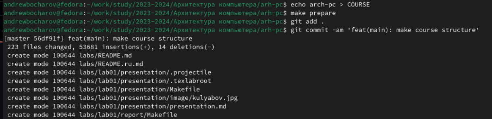{#fig:008 width=70%}

Теперь сохраним изменения и отправим файлы на сервер Github. Команда
git add . инициализирует изменения в репозитории, git commit –am ‘commit
message’ сохраняет изменения в репозитории, а команда git push отправляет
изменения в главную ветку. (рис. [-@fig:009] и рис. [-@fig:010]).

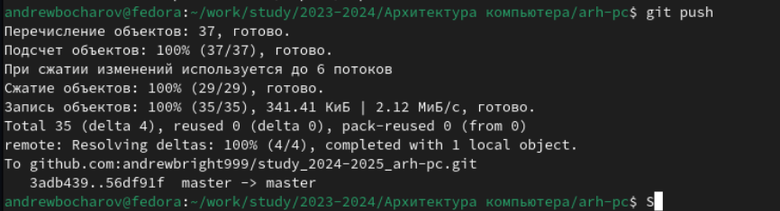{#fig:009 width=70%}

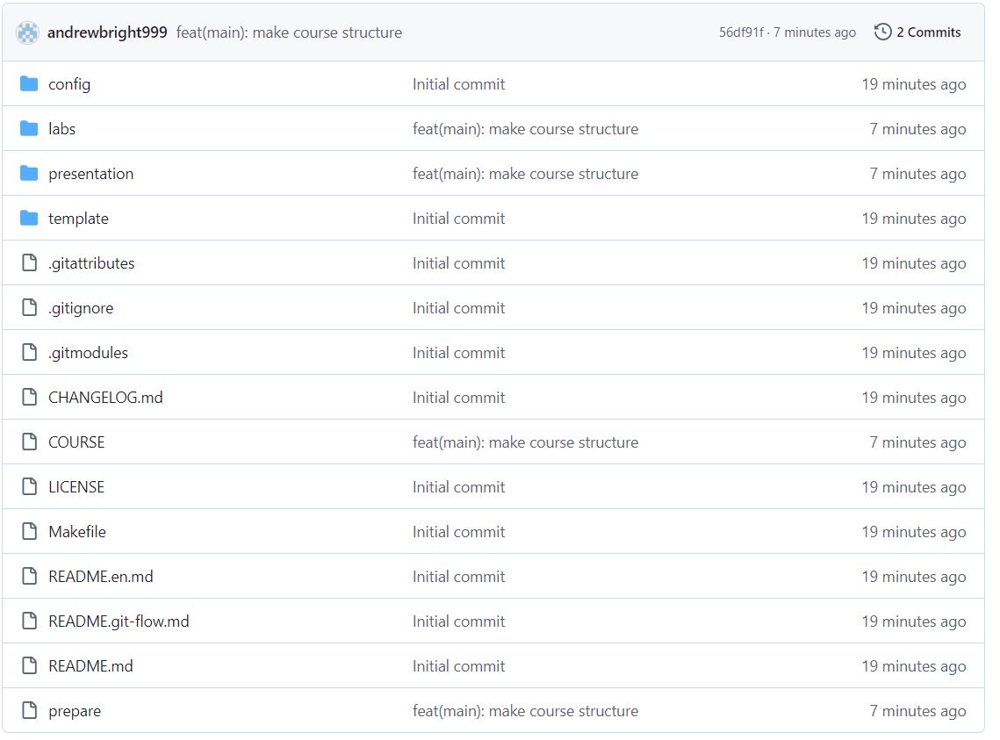{#fig:010 width=70%}

Убедимся, что изменения пришли на Github (рис. [-@fig:011]).

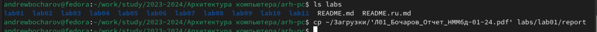{#fig:011 width=70%}

# Выполнение самостоятельной работы
Проверим, что папки для лабораторных созданы и скопируем в папку для
отчета о первой работе, файл с отчетом. (рис. [-@fig:012]).

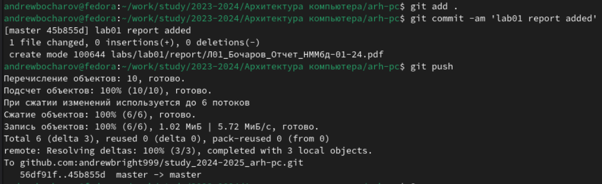{#fig:012 width=70%}

Сохраним изменения и отправим на Github. (рис. [-@fig:013]).

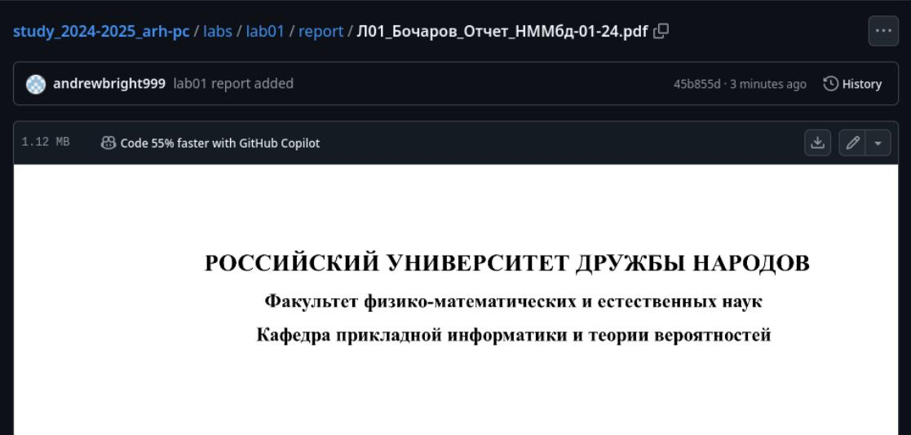{#fig:013 width=70%}

Проверим что отчет появился на странице с репозиторием. (рис. [-@fig:014]).

{#fig:014 width=70%}

# Выводы
Выполнив данную лабораторную работу, я изучил идеологию и применение
средств контроля версий. Приобрел практические навыки по работе с системой git
