---
## Front matter
title: "Лабораторная работа №5"
subtitle: ". Основы работы с
Midnight Commander (mc). Структура программы на
языке ассемблера NASM. Системные вызовы в ОС
GNU Linux"
author: "Бочаров Андрей"

## Generic otions
lang: ru-RU
toc-title: "Содержание"

## Bibliography
bibliography: bib/cite.bib
csl: pandoc/csl/gost-r-7-0-5-2008-numeric.csl

## Pdf output format
toc: true # Table of contents
toc-depth: 2
fontsize: 12pt
linestretch: 1.5
papersize: a4
documentclass: scrreprt
## I18n polyglossia
polyglossia-lang:
  name: russian
  options:
	- spelling=modern
	- babelshorthands=true
polyglossia-otherlangs:
  name: english
## I18n babel
babel-lang: russian
babel-otherlangs: english
## Fonts
mainfont: IBM Plex Serif
romanfont: IBM Plex Serif
sansfont: IBM Plex Sans
monofont: IBM Plex Mono
mathfont: STIX Two Math
mainfontoptions: Ligatures=Common,Ligatures=TeX,Scale=0.94
romanfontoptions: Ligatures=Common,Ligatures=TeX,Scale=0.94
sansfontoptions: Ligatures=Common,Ligatures=TeX,Scale=MatchLowercase,Scale=0.94
monofontoptions: Scale=MatchLowercase,Scale=0.94,FakeStretch=0.9
mathfontoptions:
## Biblatex
biblatex: true
biblio-style: "gost-numeric"
biblatexoptions:
  - parentracker=true
  - backend=biber
  - hyperref=auto
  - language=auto
  - autolang=other*
  - citestyle=gost-numeric
## Pandoc-crossref LaTeX customization
figureTitle: "Рис."
tableTitle: "Таблица"
listingTitle: "Листинг"
## Misc options
indent: true
header-includes:
  - \usepackage{indentfirst}
  - \usepackage{float} # keep figures where there are in the text
  - \floatplacement{figure}{H} # keep figures where there are in the text
---

# Цель работы

Целью работы является приобретение практических навыков работы в Midnight Commander. Освоение инструкций
языка ассемблера mov и int.

# Выполнение лабораторной работы
Открыл файловый менеджер mc(рис. [-@fig:001]).

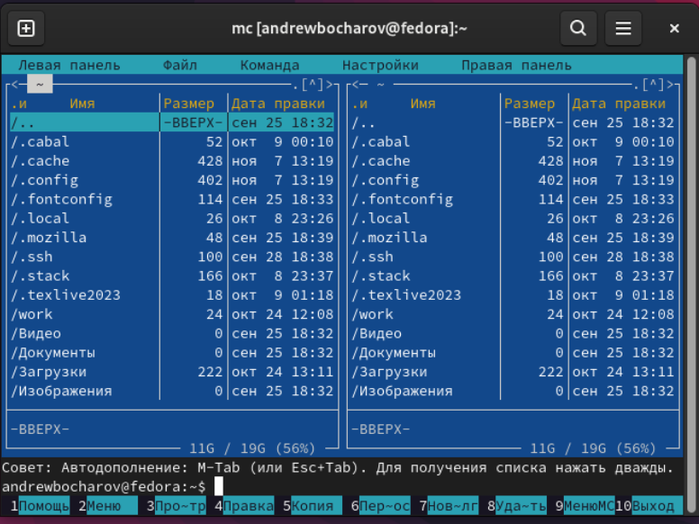{#fig:001 width=70%}

Перешел в папку `~/work/arch-pc` при помощи стрелочек и кнопки ввода (рис. [-@fig:002]).

{#fig:002 width=70%}

Создал папку `lab05` (рис. [-@fig:003]).

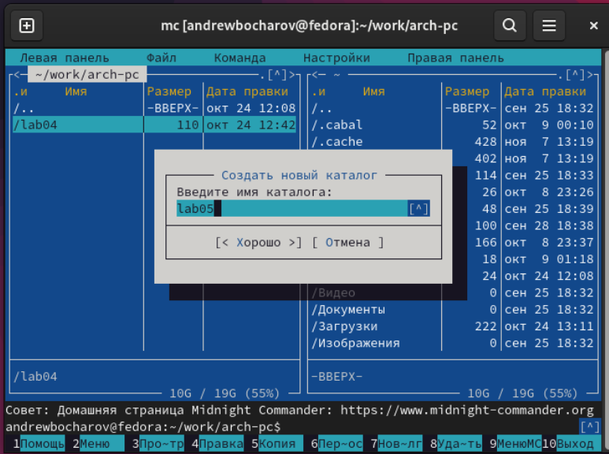{#fig:003 width=70%}

Перешел в новую папку и ввел команду для создания файла `lab5-1.asm` (рис. [-@fig:004]).

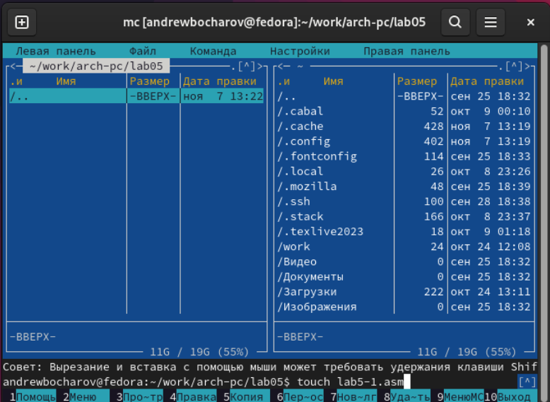{#fig:004 width=70%}

Открыл редактор mcedit клавишей `f4` (рис. [-@fig:005]).

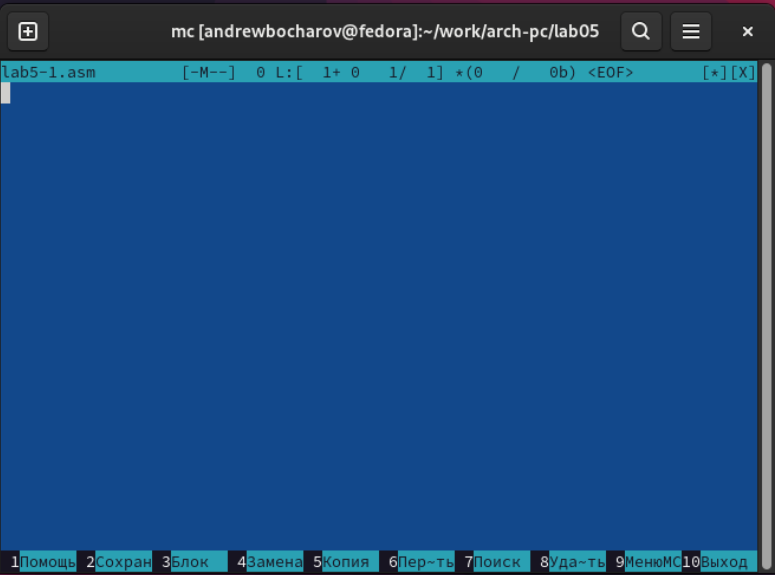{#fig:005 width=70%}

Переписал код для вывода сообщения и ввода строки с клавиатуры (рис. [-@fig:006]).

Листинг кода:

```
; Программа вывода сообщения на экран и ввода строки с клавиатуры
;---------------------------------------------------------------------
SECTION .data                    ; Секция инициированных данных
msg: DB 'Введите строку: ',10    ; сообщение

msgLen: EQU $-msg

SECTION .bss            ; Секция не инициированных данных
buf1: RESB 80           ; Буфер размером 80 байт

SECTION .text           ; Код программы
GLOBAL _start           ; Начало программы
_start:                 ; Точка входа в программу

;------------ Cистемный вызов `write`
; После вызова инструкции 'int 80h' на экран будет
; выведено сообщение из переменной 'msg' длиной 'msgLen'
    mov eax,4         ; Системный вызов для записи (sys_write)
    mov ebx,1         ; Описатель файла 1 - стандартный вывод
    mov ecx,msg       ; Адрес строки 'msg' в 'ecx'
    mov edx,msgLen    ; Размер строки 'msg' в 'edx'
    int 80h           ; Вызов ядра

;------------ системный вызов `read` ----------------------
; После вызова инструкции 'int 80h' программа будет ожидать ввода
; строки, которая будет записана в переменную 'buf1' размером 80 байт

    mov eax, 3
    mov ebx, 0
    mov ecx, buf1     ; запись адреса переменной в `EAX`
    mov edx, 80
    int 80h	  ; запись длины вводимого сообщения в `EBX`

;------------ Системный вызов `exit` ----------------------
; После вызова инструкции 'int 80h' программа завершит работу

    mov eax,1	   ; Системный вызов для выхода (sys_exit)
    mov ebx,0	   ; Выход с кодом возврата 0 (без ошибок)
    int 80h        ; Вызов ядр
```

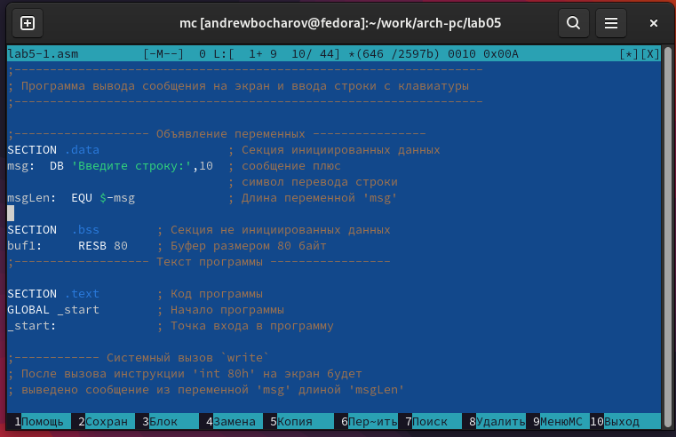{#fig:006 width=70%}

Сохранил и проверил содержимое фалйа клавишей `f3` (рис. [-@fig:007]).

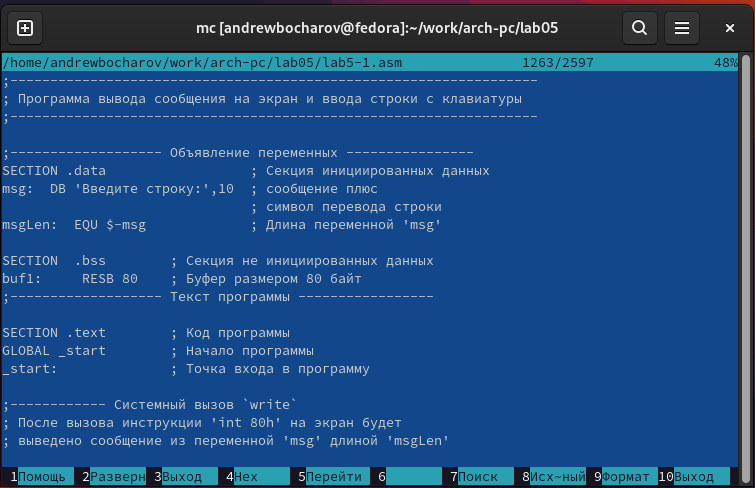{#fig:007 width=70%}

Создал объектный файл `lab5-1.o` при помощи ассемблера nasm. При помощи объктново компоновщика `ld` сделал исполняемый файл `lab5-1` (рис. [-@fig:008] и рис. [-@fig:009]).

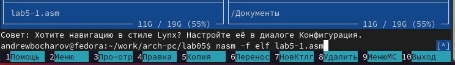{#fig:008 width=70%}

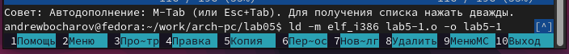{#fig:009 width=70%}

Проверил наличие файла (рис. [-@fig:010]).

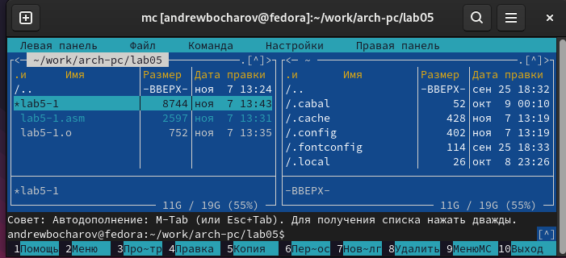{#fig:010 width=70%}

Запустил исполняемый файл, он работает (рис. [-@fig:011]).

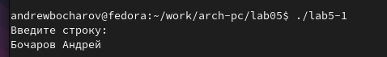{#fig:011 width=70%}

Скачал файл `in_out.asm` (рис. [-@fig:012]).

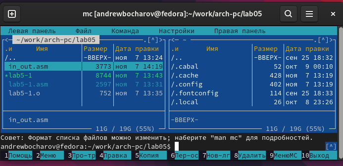{#fig:012 width=70%}

Сделал копию файла `lab5-1.asm` при помощи клавиши `f5` (рис. [-@fig:013]).

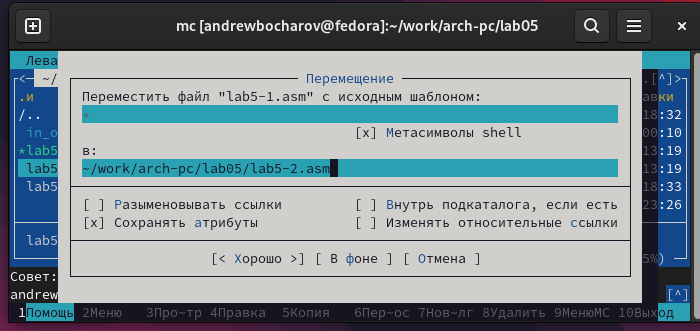{#fig:013 width=70%}

Переписал код в файле `lab5-2.asm` (рис. [-@fig:014]).

Листинг кода:

```
;--------------------------------------------------------------------
; Программа вывода сообщения на экран и ввода строки с клавиатуры
;---------------------------------------------------------------------
%include 'in_out.asm'            ; подключение внешнего файла

SECTION .data                    ; Секция инициированных данных
msg: DB 'Введите строку: ',0h    ; сообщение

SECTION .bss            ; Секция не инициированных данных
buf1: RESB 80           ; Буфер размером 80 байт

SECTION .text           ; Код программы
GLOBAL _start           ; Начало программы
_start:                 ; Точка входа в программу

mov eax, msg            ; запись адреса выводимого сообщения в `EAX`
call sprintLF             ;вызов подпрограммы печати сообщения

mov ecx, buf1           ; запись адреса переменной в `EAX`
mov edx, 80             ; запись длины вводимого сообщения в `EBX
call sread ; вызов подпрограммы ввода сообщения

call quit ; вызов подпрограммы завершения
```

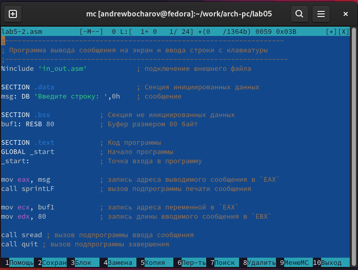{#fig:014 width=70%}

Сохранил изменения в файле `lab5-2.asm` (рис. [-@fig:015]).

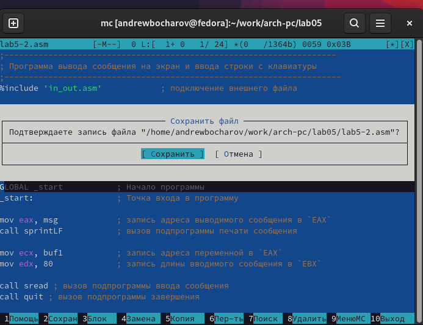{#fig:015 width=70%}

Создал объектный файл l`ab5-1.o` при помощи ассемблера nasm. При помощи объктново компоновщика `ld` сделал исполняемый файл `lab5-2`. (рис. [-@fig:016]).

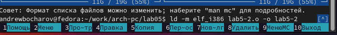{#fig:016 width=70%}

Проверил работу исполняемого файла `lab5-2` (рис. [-@fig:017]).

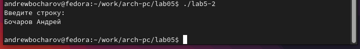{#fig:017 width=70%}

Заменил `call stringLF` на `call string` (рис. [-@fig:018]).

{#fig:018 width=70%}

Посмотерл на результат работы, команда `call stringLF` после вывода строки выводит символ переноса строки, поэтому после изменения команды, Фамилия и имя остались на том же уровне, что и "Введите данные:" (рис. [-@fig:019]).

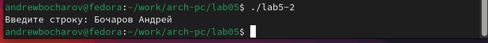{#fig:019 width=70%}

# Выполнение самостоятельной работы

Создал копию файла `lab5-1.asm` и внес в него изменения, что бы после ввода данных, они выводилилсь на экран. `mov eax,4` 

 Листинг кода:

```
; Программа вывода сообщения на экран и ввода строки с клавиатуры
;---------------------------------------------------------------------
SECTION .data                    ; Секция инициированных данных
msg: DB 'Введите строку: ',10    ; сообщение

msgLen: EQU $-msg

SECTION .bss            ; Секция не инициированных данных
buf1: RESB 80           ; Буфер размером 80 байт

SECTION .text           ; Код программы
GLOBAL _start           ; Начало программы
_start:                 ; Точка входа в программу

;------------ Cистемный вызов `write`
; После вызова инструкции 'int 80h' на экран будет
; выведено сообщение из переменной 'msg' длиной 'msgLen'
    mov eax,4         ; Системный вызов для записи (sys_write)
    mov ebx,1         ; Описатель файла 1 - стандартный вывод
    mov ecx,msg       ; Адрес строки 'msg' в 'ecx'
    mov edx,msgLen    ; Размер строки 'msg' в 'edx'
    int 80h           ; Вызов ядра

;------------ системный вызов `read` ----------------------
; После вызова инструкции 'int 80h' программа будет ожидать ввода
; строки, которая будет записана в переменную 'buf1' размером 80 байт

    mov eax, 3
    mov ebx, 0
    mov ecx, buf1     ; запись адреса переменной в `EAX`
    mov edx, 80
    int 80h	  ; запись длины вводимого сообщения в `EBX`

    mov eax, 4    ; Системный вызов для записи (sys_write)
    mov ebx, 1    ; Описатель файла 1 - стандартный вывод
    mov ecx, buf1 ; Адрес буфера
    mov edx, 80   ; Размер буфера
    int 80h       ; Вызов ядра

;------------ Системный вызов `exit` ----------------------
; После вызова инструкции 'int 80h' программа завершит работу

    mov eax,1	   ; Системный вызов для выхода (sys_exit)
    mov ebx,0	   ; Выход с кодом возврата 0 (без ошибок)
    int 80h        ; Вызов ядр
```

Сделал трансляцию, компоновку и запустил и проверил код. Код работает (рис. [-@fig:022]).

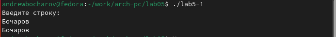{#fig:022 width=70%}

Создал копию файла `lab5-2.asm` и внес в него изменения, что бы после ввода данных, они выводилилсь на экран с использованием команд из `in_out.asm`. Листинг кода:

```
;--------------------------------------------------------------------
; Программа вывода сообщения на экран и ввода строки с клавиатуры
;---------------------------------------------------------------------
%include 'in_out.asm'            ; подключение внешнего файла

SECTION .data                    ; Секция инициированных данных
msg: DB 'Введите строку: ',0h    ; сообщение

SECTION .bss            ; Секция не инициированных данных
buf1: RESB 80           ; Буфер размером 80 байт

SECTION .text           ; Код программы
GLOBAL _start           ; Начало программы
_start:                 ; Точка входа в программу

mov eax, msg            ; запись адреса выводимого сообщения в `EAX`
call sprintLF           ;вызов подпрограммы печати сообщения

mov ecx, buf1           ; запись адреса переменной в `EAX`
mov edx, 80             ; запись длины вводимого сообщения в `EBX
call sread ; вызов подпрограммы ввода сообщения

mov eax, buf1           ;запись адреса выводимого сообщения в `EAX`
call sprint             ;вызов подпрограммы печати сообщения

call quit ; вызов подпрограммы завершения
```

Сделал трансляцию, компоновку и запустил и проверил код. Код работает (рис. [-@fig:024]).

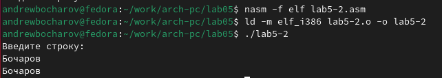{#fig:024 width=70%}

# Выводы
Выполнив данную лабораторную работу я обрел теоретические и практические знания в использовании Midnight Commander. Освоенил инструкции
языка ассемблера mov и int.
