---
## Front matter
title: "Лабораторная работа №6"
subtitle: "Арифметические операции в NASM."
author: "Бочаров Андрей"

## Generic otions
lang: ru-RU
toc-title: "Содержание"

## Bibliography
bibliography: bib/cite.bib
csl: pandoc/csl/gost-r-7-0-5-2008-numeric.csl

## Pdf output format
toc: true # Table of contents
toc-depth: 2
fontsize: 12pt
linestretch: 1.5
papersize: a4
documentclass: scrreprt
## I18n polyglossia
polyglossia-lang:
  name: russian
  options:
	- spelling=modern
	- babelshorthands=true
polyglossia-otherlangs:
  name: english
## I18n babel
babel-lang: russian
babel-otherlangs: english
## Fonts
mainfont: IBM Plex Serif
romanfont: IBM Plex Serif
sansfont: IBM Plex Sans
monofont: IBM Plex Mono
mathfont: STIX Two Math
mainfontoptions: Ligatures=Common,Ligatures=TeX,Scale=0.94
romanfontoptions: Ligatures=Common,Ligatures=TeX,Scale=0.94
sansfontoptions: Ligatures=Common,Ligatures=TeX,Scale=MatchLowercase,Scale=0.94
monofontoptions: Scale=MatchLowercase,Scale=0.94,FakeStretch=0.9
mathfontoptions:
## Biblatex
biblatex: true
biblio-style: "gost-numeric"
biblatexoptions:
  - parentracker=true
  - backend=biber
  - hyperref=auto
  - language=auto
  - autolang=other*
  - citestyle=gost-numeric
## Pandoc-crossref LaTeX customization
figureTitle: "Рис."
tableTitle: "Таблица"
listingTitle: "Листинг"
## Misc options
indent: true
header-includes:
  - \usepackage{indentfirst}
  - \usepackage{float} # keep figures where there are in the text
  - \floatplacement{figure}{H} # keep figures where there are in the text
---

# Цель работы

Целью работы является изучение арифметические инструкции языка ассемблера NASM
# Выполнение лабораторной работы
создал и першел в каталог для 6 лабораторной работы и командой touch сделал файл lab6-1.asm (рис. [-@fig:001]).

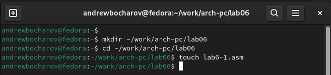{#fig:001 width=70%}

Переписал код из листинга 6.1 (рис. [-@fig:002]).

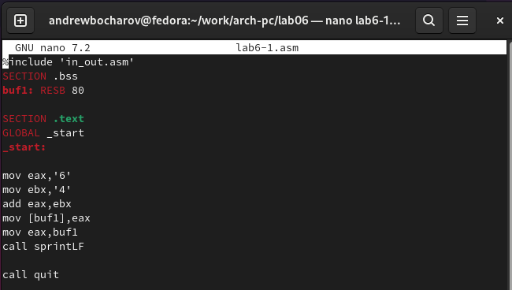{#fig:002 width=70%}

Листинг кода 6.1:

```
%include 'in_out.asm'
SECTION .bss
buf1: RESB 80

SECTION .text
GLOBAL _start
_start:

mov eax, '6'
mov ebx, '4'
add eax,ebx
mov [buf1],eax
mov eax,buf1
call sprintLF

call quit
```

Создал исполняемый файл и запустил его. (рис. [-@fig:003]).

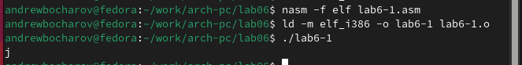{#fig:003 width=70%}	

Заменил строки с числами в ковычках, на числа без ковычек (рис. [-@fig:004]).

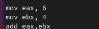{#fig:004 width=70%}

Создал исполняемый файл и запустил его. На экран выведен символ переноса строки, он соответствует коду 10 кодировки ASCII  (рис. [-@fig:005]).

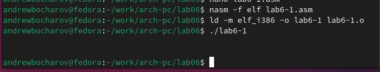{#fig:005 width=70%}

Создал файл lab6-1.asm и переписал в него листинг кода 6.2 (рис. [-@fig:006]).

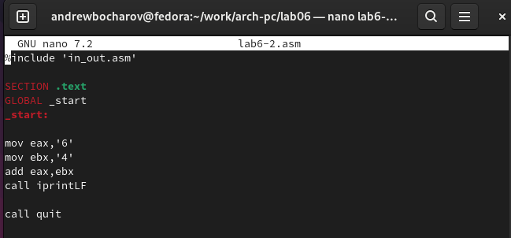{#fig:006 width=70%}

Листинг кода 6.2:

```
%include 'in_out.asm'

SECTION .text
GLOBAL _start
_start:

mov eax, 6
mov ebx, 4
add eax,ebx
call iprintLF

call quit
```

Создал исполняемый файл и запустил его. (рис. [-@fig:007]).

{#fig:007 width=70%}

Вместо символов, записал в регистры числа. Создал исполняемый файл и запустил его. (рис. [-@fig:008]).

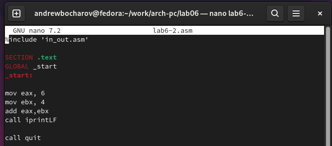{#fig:008 width=70%}

Создал исполняемый файл и запустил его. Результат работы число 10.(рис. [-@fig:009]).

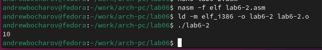{#fig:009 width=70%}

Заменил команду iprintLF на iprint. (рис. [-@fig:010]).

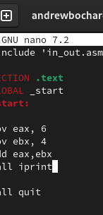{#fig:010 width=70%}

Запустил исполняемый файл, результат вывелся без переноса строки после себя. (рис. [-@fig:011]).

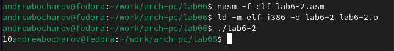{#fig:011 width=70%}

Командой touch сделал файл lab6-3.asm (рис. [-@fig:012]).

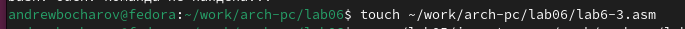{#fig:012 width=70%}

Переписал код из листинга 6.3 (рис. [-@fig:013]).

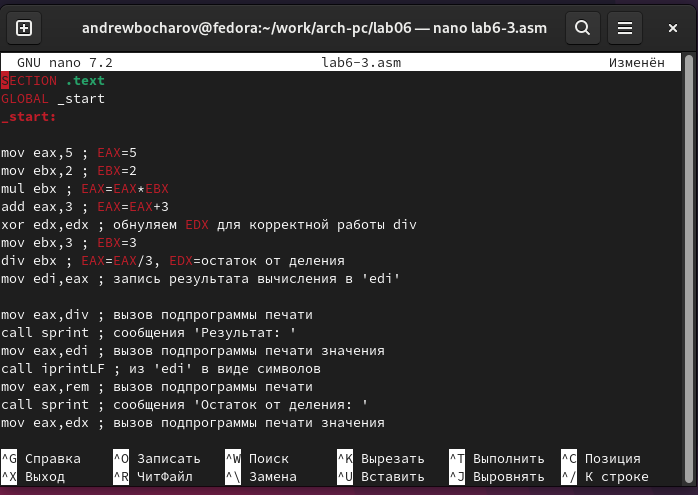{#fig:013 width=70%}

Листинг кода 6.3:

```
%include 'in_out.asm' ; подключение внешнего файла
SECTION .data
div: DB 'Результат: ',0
rem: DB 'Остаток от деления: ',0

SECTION .text
GLOBAL _start
_start:

mov eax,5 ; EAX=5
mov ebx,2 ; EBX=2
mul ebx ; EAX=EAX*EBX
add eax,3 ; EAX=EAX+3
xor edx,edx ; обнуляем EDX для корректной работы div
mov ebx, 3 ; EBX=3
div ebx ; EAX=EAX/3, EDX=остаток от деления

mov edi,eax ; запись результата вычисления в 'edi'

mov eax,div ; вызов подпрограммы печати
call sprint ; сообщения 'Результат: '
mov eax,edi ; вызов подпрограммы печати значения
call iprintLF ; из 'edi' в виде символов

mov eax,rem ; вызов подпрограммы печати
call sprint ; сообщения 'Остаток от деления: '
mov eax,edx ; вызов подпрограммы печати значения
call iprintLF ; из 'edx' (остаток) в виде символов

call quit ; вызов подпрограммы завершения
```

Создал исполняемый файл и запустил его. Результат совпадает с ожидаемым. (рис. [-@fig:014]).

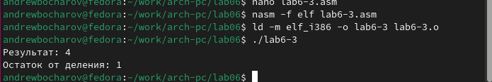{#fig:014 width=70%}

Переписал код в файле `lab6-3.asm` для вычисления выражения f(𝑥) = (4 ∗ 6 + 2)/5. (рис. [-@fig:015]).

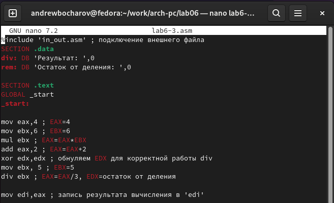{#fig:015 width=70%}

Обновленный листинг кода:

```
%include 'in_out.asm' ; подключение внешнего файла
SECTION .data
div: DB 'Результат: ',0
rem: DB 'Остаток от деления: ',0

SECTION .text
GLOBAL _start
_start:

mov eax,4 ; EAX=4
mov ebx,6 ; EBX=6
mul ebx ; EAX=EAX*EBX
add eax,2 ; EAX=EAX+2
xor edx,edx ; обнуляем EDX для корректной работы div
mov ebx, 5 ; EBX=5
div ebx ; EAX=EAX/5, EDX=остаток от деления

mov edi,eax ; запись результата вычисления в 'edi'

mov eax,div ; вызов подпрограммы печати
call sprint ; сообщения 'Результат: '
mov eax,edi ; вызов подпрограммы печати значения
call iprintLF ; из 'edi' в виде символов

mov eax,rem ; вызов подпрограммы печати
call sprint ; сообщения 'Остаток от деления: '
mov eax,edx ; вызов подпрограммы печати значения
call iprintLF ; из 'edx' (остаток) в виде символов

call quit ; вызов подпрограммы завершения
```

Создал исполняемый файл и запустил его. Результат совпадает с ожидаемым. (рис. [-@fig:016]).

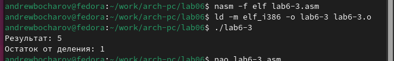{#fig:016 width=70%}

Создал файл variant.asm и переписал в него листинг кода 6.4 (рис. [-@fig:017]).

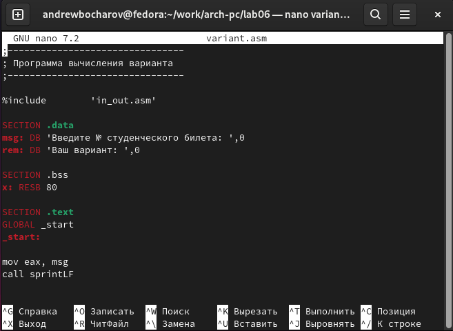{#fig:017 width=70%}

Листинг 6.4:

```
;--------------------------------
; Программа вычисления варианта
;--------------------------------

%include	'in_out.asm'

SECTION .data
msg: DB 'Введите № студенческого билета: ',0
rem: DB 'Ваш вариант: ',0

SECTION .bss
x: RESB 80

SECTION .text
GLOBAL _start
_start:

mov eax, msg
call sprintLF

mov ecx, x
mov edx, 80
call sread

mov eax,x ; вызов подпрограммы преобразования
call atoi ; ASCII кода в число, `eax=x`
xor edx,edx
mov ebx,20
div ebx
inc edx

mov eax,rem
call sprint
mov eax,edx
call iprintLF

call quit
```

Создал исполняемый файл и запустил его, ввел номер своего студенческого билета, в ответ выведен номер моего варианта. (рис. [-@fig:018]).

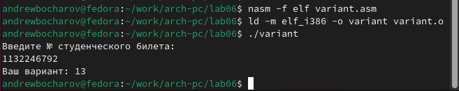{#fig:018 width=70%}

Ответы на вопросы:
1. За вывод на экран сообщения ‘Ваш вариант:’ отвечают строчки 
	```mov eax,rem
	call sprint```
2.  Инструкции
	```mov ecx, x
	mov edx, 80
	call sread```
	отвечают за сохранение вввода в консоль в х
	
3 Инструкция “call atoi” переводит строку из консоли в число
	
4 За вычисления варианта отвечают строчки
 	```mov ebx,20
	div ebx
	inc edx```
5 Остаток от деления при выполнении инструкции ```div ebx``` 
записывается в регистр edx

6 Инструкция ```inc edx``` увеличивает значения числа в регистре на 1

7 За вывод на экран результата вычислений отвечают строки
	```mov eax,edx
	call iprintLF```

# Выполнение самостоятельной работы

Создал новый файл и написал в него код отвечающий за вычисление формулы соответсвующей моему варианту. (рис. [-@fig:019]).

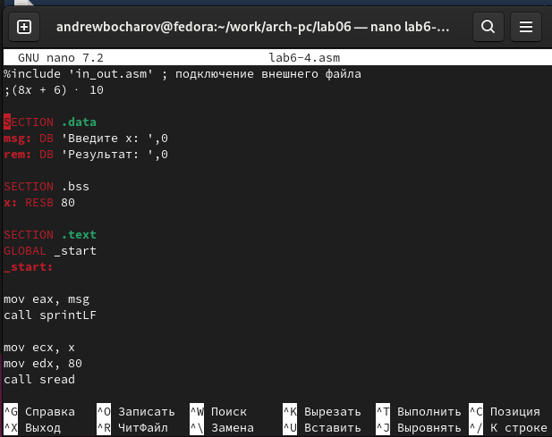{#fig:019 width=70%}

 Листинг кода:

```
%include 'in_out.asm' ; подключение внешнего файла
;(8𝑥 + 6) ⋅ 10

SECTION .data
msg: DB 'Введите x: ',0
rem: DB 'Результат: ',0

SECTION .bss
x: RESB 80

SECTION .text
GLOBAL _start
_start:

mov eax, msg
call sprintLF

mov ecx, x
mov edx, 80
call sread

mov eax,x ; вызов подпрограммы преобразования
call atoi ; ASCII кода в число, `eax=x`

mov ebx,8 ; EBX=8
mul ebx; EAX=EAX*EBX

add eax, 6 ; EAX=EAX+6
mov ebx,10 ; EBX=10
mul ebx ; EAX=EAX*EBX, EBX=Произвидение
mov edx, eax

mov eax, rem ; вызов подпрограммы печати
call sprint ; сообщения 'Результат: '
mov eax, edx ; вызов подпрограммы печати значения
call iprintLF ; из 'edi' в виде символов

call quit ; вызов подпрограммы завершения
```

Сделал трансляцию, компоновку и запустил и проверил код. Код выводит правльные ответы, полученные аналитическим методом. (рис. [-@fig:020]).

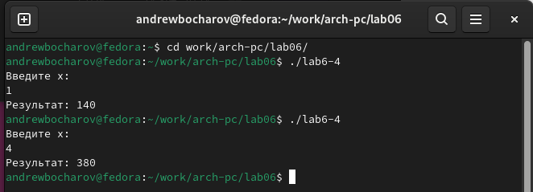{#fig:020 width=70%}

Создал копию файла `lab5-2.asm` и внес в него изменения, что бы после ввода данных, они выводилилсь на экран с использованием команд из `in_out.asm`. Листинг кода:


# Выводы
Выполнив данную лабараторную работу, я oсвоил арифметические инструкции языка ассемблера NASM
